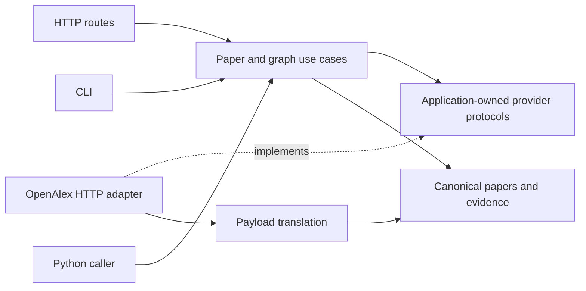

# Extending the code

Start with one observable behavior and its acceptance criteria. Locate its owner in
the [source map](../src/research_bridge/README.md), read that capability's README,
and inspect nearby code and tests. The [development guide](development.md) covers
commands; [architecture](architecture.md) governs imports and
[product context](product.md) governs research meaning.

## Follow a request



`api/app.py` and `cli.py` compose concrete adapters. `ResolvePaper`, `SearchPapers`
and `ExploreCitations` receive narrow provider protocols through constructors.
`AcquisitionBudget` owns mutable physical-request/deadline accounting for one
operation. Validated dataclasses own inputs and results; traversal state stays
local to an execution so one call cannot contaminate another.

The adapter pattern isolates OpenAlex I/O. Separate lookup, title-search and incoming
protocols let a provider implement only the operations it supports. Constructor
injection lets offline fakes replace HTTP acquisition without changing business
rules. Stateless payload translation uses functions. These responsibilities already
supply useful OOP, interface segregation and dependency inversion.

## Add a metadata filter

This is a change path through the existing implementation, not a request to add a
new filter now.

1. Define matching and unknown-value semantics in
   [filters.py](../src/research_bridge/knowledge_graph/application/filters.py).
   Keep validation and matching there so every caller observes the same rule.
2. Extend [filter tests](../tests/knowledge_graph/test_filters.py) with matches,
   nonmatches, missing metadata, invalid bounds and interaction with partial graphs.
   Assert that excluded intermediates still expand and the seed remains retained.
3. Expose only the input shape in
   [HTTP requests](../src/research_bridge/api/research.py) and
   [CLI arguments](../src/research_bridge/cli.py). Both construct the application
   predicate; neither implements a second matching algorithm.
4. Update the graph capability contract and relevant usage examples. Export and
   review the OpenAPI diff, run focused tests, then the full check/install targets.

## Extend paper metadata

The canonical shape belongs in
[paper.py](../src/research_bridge/research/papers/domain/paper.py). OpenAlex-specific
extraction belongs in
[translation.py](../src/research_bridge/ingestion/openalex/infrastructure/translation.py).
Define how missing/malformed optional data behaves before implementing it. Preserve
zero versus unknown, source evidence and provider-reported inference status.

Use [adapter tests](../tests/ingestion/openalex/test_openalex_adapter.py) and
[translation failure tests](../tests/ingestion/openalex/test_payload_errors.py) for
payload behavior. Update journeys when the public result changes. Domain values
must remain independent of HTTPX, FastAPI and raw provider payloads.

## Add an HTTP operation

Define or reuse the framework-independent use case first. Add the request schema
and handler under `api/`, inject the use case, and compose it in `api/app.py`.
Map expected errors into the existing safe response conventions. Read
[the API contract](../src/research_bridge/api/README.md), exercise the operation
with an injected fake, and review the exported schema. A stateless endpoint such
as health needs a function and response value, not a service hierarchy.

## Change acquisition or add an approved provider

Read the owning protocol's docstring and its failure/budget semantics. All physical
requests, redirects and retries consume the shared operation budget. Cancellation
must stop acquisition, and injected clients remain owned by their callers. Keep
HTTP retry behavior in the existing adapter and pure field conversion in translation.

A new provider belongs in its own ingestion capability only when requested. It
implements the existing protocols and returns canonical attributed records. Extend
the explicit dependency map in [architecture checks](../tests/test_architecture.py)
when introducing a capability, with its allowed direction documented in architecture.
Current identity contracts require OpenAlex work identifiers; supporting records
without them is a deliberate canonical-model change, not just swapping a URL.

## Human and agent workflow

Use the same acceptance criteria, source map and commands for manual or agentic work.
[AGENTS.md](../AGENTS.md) is authoritative; focused skills are optional task-specific
workflows linked from it. Read only the affected capability and relevant history,
not every skill or every historical verification entry.

A useful work request or handoff contains:

```text
Behavior: what a caller can do after the change, including an example.
Owner: capability and entrypoints affected; existing contracts to reuse.
Acceptance: expected results, failures, bounds and compatibility constraints.
Context: relevant code, tests and documentation already inspected.
Work state: files changed and decisions taken; preserve existing unrelated work.
Verification: exact commands, outcomes and checks still needed.
```

Before editing, state the smallest useful slice and responsibilities. Review the
focused diff before broadening it. After repeated failures, reproduce and inspect
the cause before trying another correction. Finish with behavior changed, actual
verification, compatibility and unresolved limits. Follow the naming and Google-style
documentation requirements in [coding style](coding-style.md).

## Keep the design proportional

Use immutable values for invariants, cohesive objects for stateful behavior, and
functions for stateless transformations. Reuse an existing rule when its meaning
and owner are the same. Similar HTTP and CLI error mappings can remain separate
because their status/exit semantics differ; avoid coupling transports just to reduce
line count. Likewise, graph and search budgets share acquisition accounting but
have different result bounds and completion semantics.

Preserve the current single distribution, optional server boundary and direct
composition until an implemented requirement needs more. New abstractions should
make this change easier to reason about or test. Explain that need in the PR.
