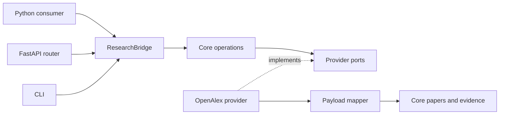

# Extending the code

Start with observable behavior and locate its owner in the
[source map](../src/research_bridge/README.md). Product meaning comes from
[product context](product.md); package boundaries come from
[architecture](architecture.md).

## Request flow

```mermaid
flowchart LR
    Python[Python consumer] --> Bridge[ResearchBridge]
    HTTP[FastAPI router] --> Bridge
    CLI[CLI] --> Bridge
    Bridge --> Core[Core operations]
    Core --> Ports[Provider ports]
    OpenAlex[OpenAlex provider] -. implements .-> Ports
    OpenAlex --> Mapper[Payload mapper]
    Mapper --> Models[Core papers and evidence]
```

`ResearchBridge` is the public orchestration boundary. `api/router.py` and `cli.py`
only translate their inputs and outputs. They do not instantiate individual use cases
or repeat research rules.

## Change a business rule

Put framework-independent rules in the focused `core/` module that owns the value or
operation:

- identifier syntax: `core/identifiers.py`;
- paper metadata: `core/papers.py`;
- attribution: `core/evidence.py`;
- search bounds and paging: `core/search.py`;
- citation result contracts: `core/citations.py`;
- traversal: `core/explorer.py`;
- metadata matching: `core/filters.py`;
- request/deadline accounting: `core/budget.py`.

Test the rule directly with a fake core port. Update HTTP or CLI only when their public
input/output shape must change.

## Add or change an HTTP operation

1. Add or reuse a method on `ResearchBridge` backed by a core operation.
2. Put HTTP input models in `api/schemas.py`.
3. Add the short transport handler to `api/router.py`.
4. Add expected error translation to `api/errors.py` only for a stable core error.
5. Exercise both the standalone app and an embedded caller-owned app.
6. Export and review `contracts/openapi.json`.

Do not use `app.state` as a service locator. Do not construct a provider in the router.
The standalone default belongs in `api/app.py`; another FastAPI application supplies
its own `ResearchBridge` instance.

## Change OpenAlex acquisition

Provider HTTP behavior belongs in `providers/openalex/client.py`. Pure payload mapping
belongs in `providers/openalex/mapper.py`; environment-backed configuration belongs in
`providers/openalex/settings.py`. Provider modules may depend on core contracts, while
core modules must never import the provider.

All physical requests, redirects, and retries consume the shared operation budget.
Cancellation must stop acquisition, and injected clients remain caller-owned.

## Add another provider

Implement only the ports needed from `core/ports.py` and return canonical core values.
Do not add a registry or factory until more than one runtime composition needs provider
selection. Current public papers require an OpenAlex work identity; supporting a
provider without one requires an explicit model and contract decision.

## Verify a change

Use focused tests while developing, then run the README gates appropriate to the
change. For executable changes, run `make check`, `make install-check`, and `make smoke`.
Report actual commands and outcomes. Keep new public code documented with Google-style
docstrings and review the final diff for duplicated rules or unnecessary indirection.
